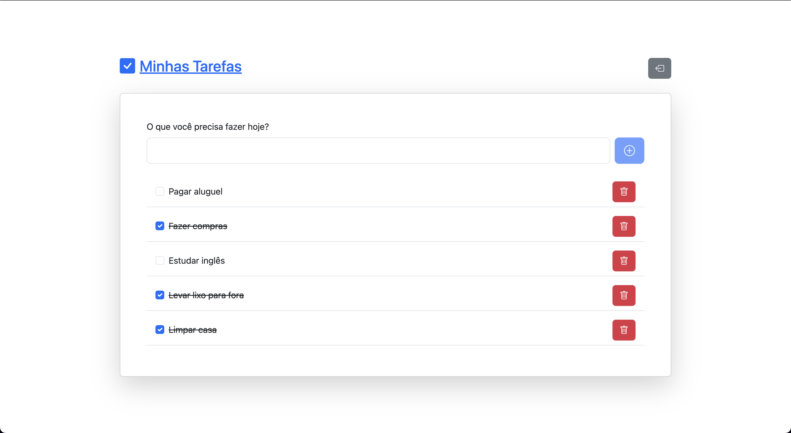
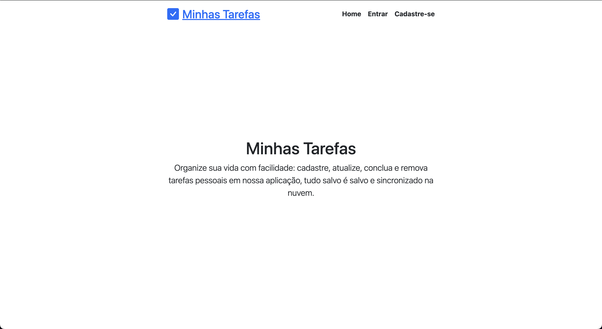
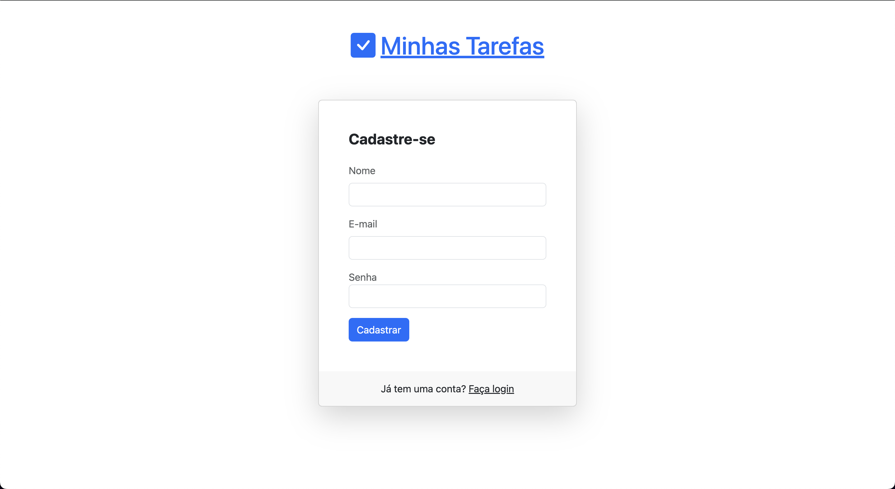

# API Minhas Rotinas

- ### Configurando a API
  


Esse backend traz todas as principais funcionalidades de uma lista de tarefas, além de persistir as tarefas em um banco de dados. Essa API foi feita como trabalho final da disciplina de desenv plataformas web.

## ⚙️ Funcionalidades

- Criação de usuários (`[POST] /register`)
- Autenticação de usuários via JWT (`[POST] login`)
- Listagem de tarefas (`[GET] /tasks`)
- Criação de tarefas (`[POST] /task`)
- Remoção de tarefas (`[DELETE] /task/:id`)
- Atualização de tarefas (`[PUT] /task/:id`)

## 🛠 Tecnologias

As seguintes ferramentas foram usadas na construção do backend:

- Node.js (v20.14.0)
- Express
- MongoDB Atlas
- Mongoose

## 🚀 Como executar o projeto api

> Antes de tudo tenha certeza que você tem o ambiente Node.js configurado na sua máquina.

Clone o projeto e depois de baixado entre na raiz do projeto e execute:

```bash
npm install
```

Logo após, defina um arquivo `.env` na raiz do projeto e copie todas as variavéis do `.env.example` e cole nele. Preencha cada uma das variáveis com seus valores correspondentes.

```
MONGODB_URI="coloque aqui sua url de conexão com o MongoDB"
PORT=3333
SECRET_KEY="minhachavesecreta"
```

Feito isso, execute o comando na raiz:
```bash
npm run dev
```

## Se tudo estiver certo, o backend irá iniciar 🚀


<h1 align="center">
  Rotinas Diarias
</h1>

<p align="center" style="margin-right: 8px">
  
</p>


## 💻 Sobre o projeto


Esse front end traz todas as principais funcionalidades de uma lista de tarefas, além de se comunicar com uma API REST para para salvar suas tarefas. Este sistema foi feito como trabalho final da disciplina de desenv plataformas web.

## ⚙️ Funcionalidades

- Apresentação da aplicação (Landing Page)

  

- Criação de usuários

  

- Autenticação de usuários via JWT

  

- Autenticado você é redirecionado para a dashboard onde estará listado suas tarefas. Você pode adicionar, remover e marcar como concluído as tarefas.

  

## 🛠 Tecnologias

As seguintes ferramentas foram usadas na construção do projeto:

- React com Vite
- React Router Dom
- Bootstrap
- Axios
- React Query
- Sonner (para toast notifications)

## 🚀 Como executar o projeto


Clone o projeto e depois de baixado entre na raiz do projeto e execute:

```bash
  npm install
```

Como falado anteriormente, você precisa rodar o backend feito para essa aplicação para o funcionamento correto. Defina um arquivo `.env.local` na raiz do projeto e copie todas as variavéis do `.env.local.example`.

```
VITE_API_URL="Defina a url do backend local aqui"
```

Feito isso, execute o comando na raiz:

```bash
npm run dev
```

## Se tudo estiver certo, o frontend irá iniciar 🚀

